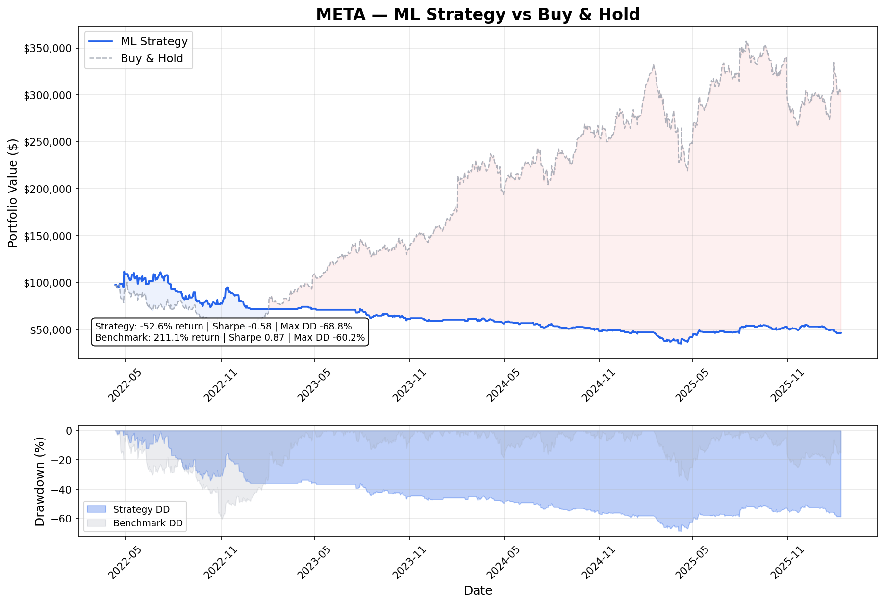
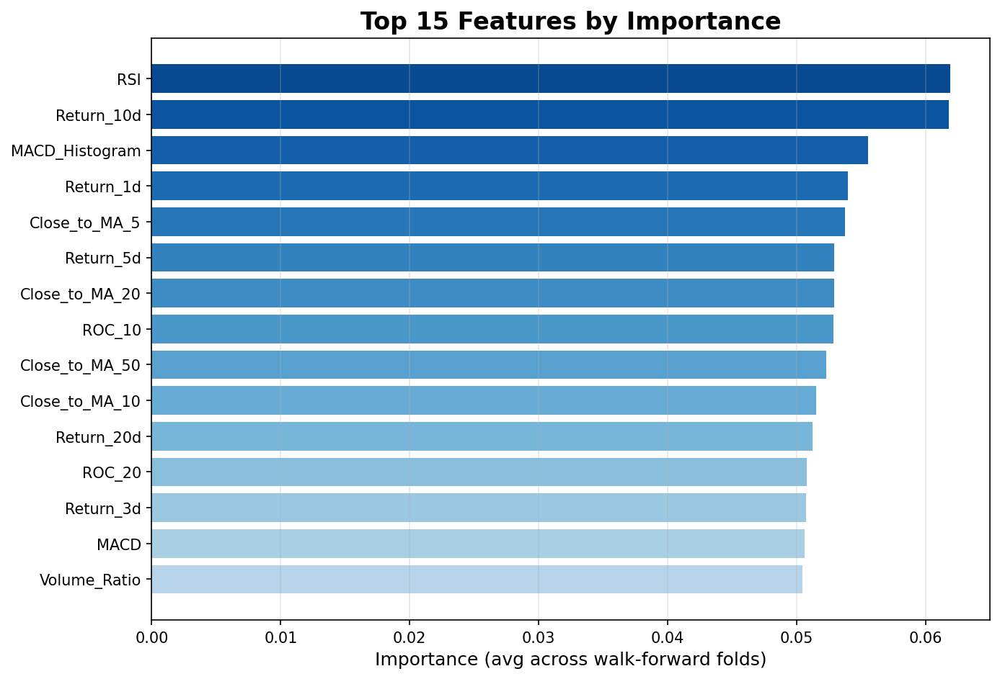
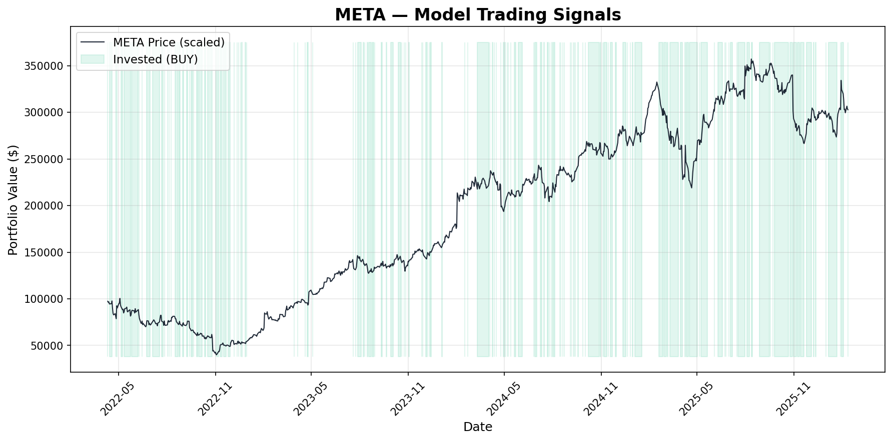

# 📈 ML Trading Signal Generator

An end-to-end machine learning pipeline that generates buy/sell signals for META (Meta Platforms) using XGBoost and technical indicator features, validated with walk-forward backtesting to prevent look-ahead bias.

## Overview

This project builds a binary classification model that predicts whether META's next-day return will be positive or negative. Unlike naive approaches that use random train/test splits, this pipeline uses **expanding-window walk-forward validation** — the same methodology used by professional quant researchers — to ensure all predictions are made on truly unseen future data.

### Key Features
- **20+ engineered technical features** across trend, momentum, volatility, volume, and return categories
- **Walk-forward validation** eliminates look-ahead bias by training strictly on past data
- **Professional financial metrics**: Sharpe ratio, max drawdown, profit factor, win rate
- **Feature importance analysis** to understand what drives predictions
- **Automated chart generation** for equity curves, signals, and feature rankings

## Results

> After running `python main.py`, your results will appear in the `results/` folder.

### Equity Curve


### Feature Importance


### Trading Signals


## Methodology

### 1. Data
- **Source**: Yahoo Finance via `yfinance`
- **Ticker**: META (Meta Platforms)
- **Period**: 5 years of daily OHLCV data (~1,250 trading days)
- **Rationale**: 5 years balances sample size with regime relevance — patterns from too far back may not reflect META's current business

### 2. Feature Engineering
Features are grouped into five categories, all computed using backward-looking rolling windows to prevent data leakage:

| Category | Features | Purpose |
|---|---|---|
| **Trend** | Moving Average ratios (5/10/20/50-day), MACD, MACD Signal, MACD Histogram | Capture directional bias |
| **Momentum** | RSI (14-day), Rate of Change (5/10/20-day) | Detect overbought/oversold conditions |
| **Volatility** | Bollinger Band position, ATR (% of price) | Measure risk and mean-reversion potential |
| **Volume** | Volume/MA ratio | Gauge conviction behind price moves |
| **Returns** | Lagged returns (1/3/5/10/20-day) | Short and medium-term momentum |

**Leakage prevention**: Raw price levels (Close, MA values, Bollinger Band levels) are excluded from the feature set. Only scale-invariant ratios and normalized values are used, so the model learns *patterns*, not price levels.

### 3. Model
- **Algorithm**: XGBoost (Gradient Boosted Trees)
- **Target**: Binary — will tomorrow's close be higher than today's? (1 = yes, 0 = no)
- **Hyperparameters**: Conservative defaults (max_depth=4, learning_rate=0.05, subsample=0.8) to prioritize generalization over training accuracy. Parameters are intentionally **not** tuned on test data to avoid another form of leakage.

### 4. Walk-Forward Validation

```
Fold 1: [===TRAIN (Year 1)===]     [TEST (Year 2)]
Fold 2: [======TRAIN (Years 1-2)======]     [TEST (Year 3)]
Fold 3: [==========TRAIN (Years 1-3)==========]     [TEST (Year 4)]
Fold 4: [=============TRAIN (Years 1-4)==============]     [TEST (Year 5)]
```

Each fold trains **only on past data** and predicts the next unseen period. The training window expands with each fold, giving the model progressively more history to learn from. This mimics how a real trading system would operate.

### 5. Backtesting
- **Strategy**: Invest in META on days the model predicts UP; hold cash otherwise
- **Benchmark**: Buy-and-hold META for the entire period
- **Starting capital**: $100,000
- **Metrics**: Total return, annualized return, Sharpe ratio, max drawdown, win rate, profit factor, market exposure

## Project Structure

```
ml-trading-signals/
├── main.py              # Entry point — runs the full pipeline
├── data_loader.py       # Downloads and cleans stock price data
├── features.py          # Engineers technical indicator features
├── model.py             # XGBoost training with walk-forward validation
├── backtest.py          # Simulates trading and calculates performance metrics
├── requirements.txt     # Python dependencies
├── README.md            # This file
└── results/             # Generated after running main.py
    ├── equity_curve.png
    ├── feature_importance.png
    ├── signals.png
    ├── predictions.csv
    └── feature_importance.csv
```

## Installation & Usage

### Prerequisites
- Python 3.9+

### Setup
```bash
# Clone the repository
git clone https://github.com/YOUR_USERNAME/ml-trading-signals.git
cd ml-trading-signals

# Install dependencies
pip install -r requirements.txt

# Run the full pipeline
python main.py
```

Results will be printed to the console and saved in the `results/` folder.

### Customization
Edit the configuration at the top of `main.py`:
```python
TICKER = "META"              # Change to any Yahoo Finance ticker
PERIOD = "5y"                # "1y", "2y", "5y", "10y", "max"
INITIAL_CAPITAL = 100_000    # Starting portfolio value
CONFIDENCE_THRESHOLD = 0.5   # Higher = fewer but more confident trades
```

## Limitations & Future Work

**This is a research/educational project, not a live trading system.** Key limitations:

- **No transaction costs**: Real trading incurs commissions and slippage that reduce returns
- **No position sizing**: The strategy is fully invested or fully in cash — no partial positions
- **Daily resolution**: Misses intraday price movements and assumes execution at close prices
- **Single asset**: No portfolio diversification or cross-asset signals
- **Survivorship bias**: META is a successful stock that still exists — testing on failed companies would give different results

### Potential Improvements
- Add transaction cost modeling (e.g., 10bps per trade)
- Implement position sizing based on prediction confidence
- Add more assets and cross-sectional features
- Experiment with LSTM or Transformer architectures for sequential patterns
- Add walk-forward hyperparameter optimization with a validation set

## Disclaimer

This project is for **educational and research purposes only**. It is not financial advice. Past performance does not guarantee future results. Do not use this system for live trading without extensive additional validation, risk management, and regulatory compliance.
