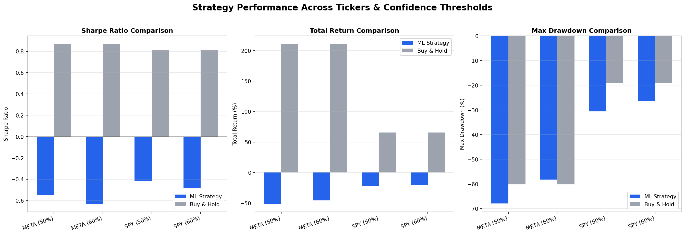
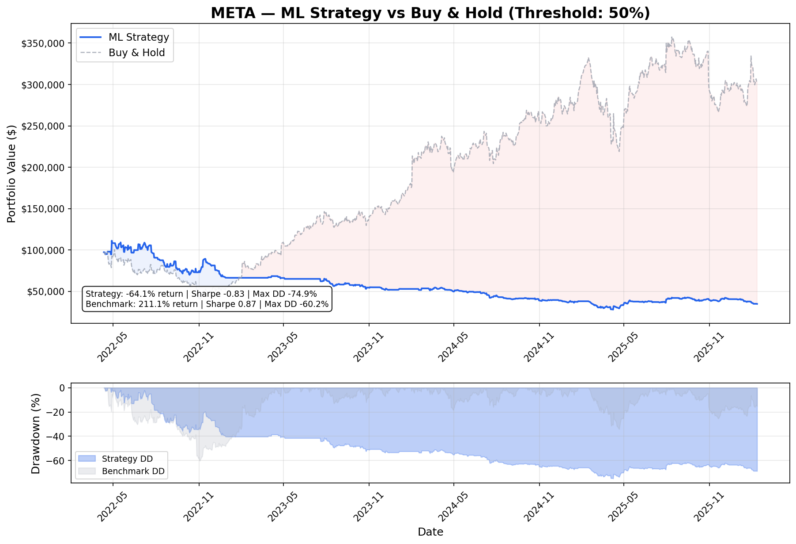
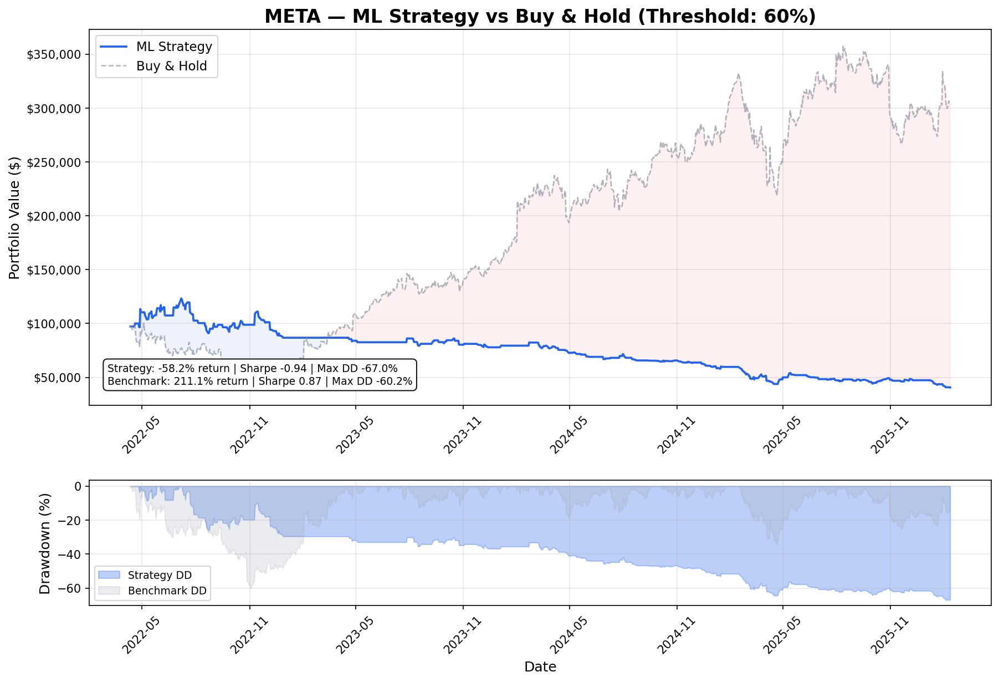
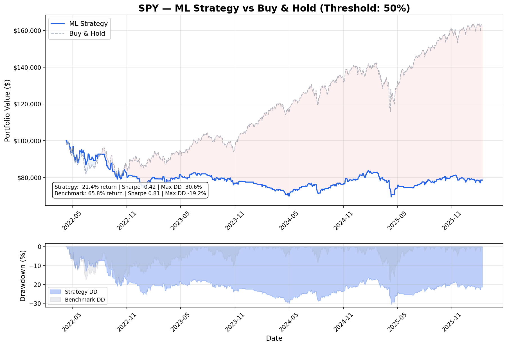
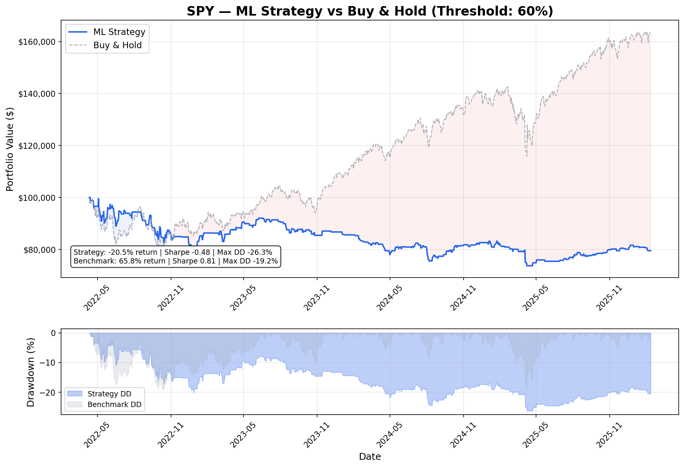
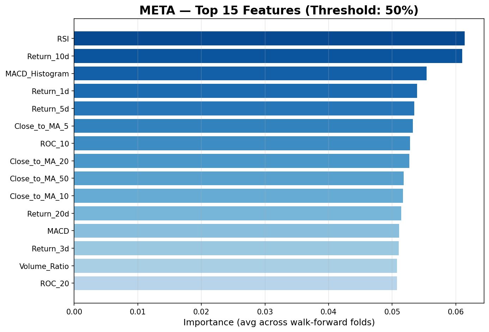

# ML Trading Signal Generator

An end-to-end machine learning pipeline that generates buy/sell signals using XGBoost and technical indicator features, validated with walk-forward backtesting to prevent look-ahead bias. The project compares strategy performance across multiple tickers (META, SPY) and confidence thresholds (50%, 60%), with transaction cost modeling for realistic performance estimates.

## Overview

This project builds a binary classification model that predicts whether a stock's next-day return will be positive or negative. Unlike naive approaches that use random train/test splits, this pipeline uses **expanding-window walk-forward validation** — the same methodology used by professional quant researchers — to ensure all predictions are made on truly unseen future data.

The pipeline runs across **multiple tickers** and **confidence thresholds** to analyze how the model performs under different conditions — revealing important insights about market efficiency and the limits of technical-indicator-based strategies.

### Key Features
- **20+ engineered technical features** across trend, momentum, volatility, volume, and return categories
- **Walk-forward validation** eliminates look-ahead bias by training strictly on past data
- **Multi-ticker, multi-threshold comparison** (META × SPY × 50% × 60%) to analyze strategy behavior
- **Transaction cost modeling** (10bps per trade) for realistic performance estimates
- **Professional financial metrics**: Sharpe ratio, max drawdown, profit factor, win rate
- **Feature importance analysis** to understand what drives predictions
- **Honest strategy analysis** with discussion of limitations and potential improvements

## Results

> Run `python main.py` to generate all results in the `results/` folder.

### Cross-Configuration Comparison


### META — 50% Confidence Threshold


### META — 60% Confidence Threshold


### SPY — 50% Confidence Threshold


### SPY — 60% Confidence Threshold


### Feature Importance (META)


## Strategy Analysis

### Key Findings

**1. Buy-and-hold is extremely difficult to beat during bull markets.**

META returned over 200% during the test period (2021–2025), driven by an exceptional AI-fueled rally. The ML strategy returned approximately -53% over the same period. This dramatic underperformance is actually the expected result — and understanding why is more valuable than artificially inflating backtest returns.

The core issue: the strategy holds cash whenever the model predicts "down." In a strong bull market, there are more up days than down days, so every day spent in cash is likely a missed gain. The model would need near-perfect accuracy at predicting down days to justify sitting out — and daily prediction is far too noisy for that level of precision.

**2. The model performs consistently (poorly) across all configurations.**

All four configurations (META 50%, META 60%, SPY 50%, SPY 60%) produced negative Sharpe ratios. This consistency tells us the problem isn't the ticker or the threshold — it's that daily direction prediction from technical indicators alone doesn't generate sufficient alpha. This is a well-established finding in academic quantitative finance.

**3. Confidence threshold impacts exposure but doesn't fix the core problem.**

Raising the threshold from 50% to 60% reduces market exposure — the model trades less often because it only acts when more confident. While this filters out low-conviction trades, it also means the model sits in cash even more, missing additional up days during the bull market. The trade-off between selectivity and opportunity cost is a fundamental challenge in signal-based strategies.

**4. Transaction costs compound and matter.**

At 10 basis points (0.1%) per trade, transaction costs seem negligible on any single trade. But the strategy switches between invested and cash frequently, and these costs compound over hundreds of trades across the backtest period. This is why professional quant strategies focus heavily on minimizing turnover — even small friction adds up.

**5. Different assets respond similarly to the same model.**

SPY (S&P 500) is a more diversified, less volatile asset than META. Despite these differences, the model fails on both — confirming that the limitation is the approach (technical indicators → daily prediction), not the specific asset.

### Why the Model Underperforms: A Deeper Explanation

Predicting daily stock direction is one of the hardest problems in quantitative finance. Here's why technical indicators alone aren't sufficient:

**Signal-to-noise ratio is extremely low.** Daily stock returns are dominated by noise — random fluctuations driven by news, sentiment, and market microstructure. The actual predictable signal (if it exists) is tiny compared to this noise. Even a model with 52% accuracy would be considered excellent, but achieving even that consistently is remarkably difficult.

**No single indicator is a strong predictor.** RSI being above 70 doesn't reliably predict a drop. MACD crossing above zero doesn't reliably predict a rally. The model's job is to find *combinations* of indicators that together predict direction — for example, "RSI below 30 AND volume spiking AND 5-day return is -3%" might predict a bounce. XGBoost is well-suited for finding these non-linear interactions, but the underlying signal may simply be too weak in daily data.

**Regime dependence.** Patterns that work in high-volatility bear markets may fail completely in low-volatility bull markets, and vice versa. The 2021–2025 test period was dominated by a strong bull regime for both META and SPY. Our features don't explicitly model market regime, so the model can't adapt its behavior.

**Feature limitations.** Technical indicators only capture price and volume dynamics. They miss fundamentals (earnings, revenue growth), sentiment (news, social media), macroeconomic factors (interest rates, GDP), and cross-asset correlations. Real quant strategies typically incorporate dozens of alternative data sources.

### The Trading Logic: Invest vs Cash

The strategy operates with a simple binary decision each day:

| Model Output | Action | Rationale |
|---|---|---|
| Probability ≥ threshold → **BUY (1)** | Invest in the stock | We expect the price to rise, so we want to capture that return |
| Probability < threshold → **SELL (0)** | Hold cash (0% return) | We expect the price to fall, so we sit out to avoid the loss |

The **Exposure %** metric shows what fraction of the time the strategy is invested vs in cash. Lower exposure means the model is being more selective but also missing more market days.

A limitation of this binary approach is that there's no "hold" state — the model can't say "I'm not sure, so keep whatever position I had yesterday." This leads to excessive trading (position churn) which increases transaction costs. A more sophisticated three-state system (strong buy / hold current position / strong sell) would reduce this churn.

### Honest Self-Assessment

This model does not beat buy-and-hold. That's a realistic and instructive result — most academic models don't survive contact with real markets. The value of this project is in the methodology:

- **Proper walk-forward validation** — no look-ahead bias, no data leakage
- **Realistic transaction cost modeling** — not an idealized frictionless backtest
- **Multi-asset, multi-threshold comparison** — systematic analysis, not cherry-picked results
- **Transparent analysis** — honest about what works, what doesn't, and why

A project showing "500% returns" with no critical analysis is a red flag for overfitting or leakage. A project showing realistic results with sound methodology and honest discussion demonstrates the thinking process that matters in quantitative research.

### Potential Improvements

**Alternative data sources.** Adding sentiment analysis (news/social media), earnings surprises, or macroeconomic indicators could provide signals that technical indicators miss. Technical indicators only capture price and volume — they're blind to the *reasons* behind price moves.

**Regime detection.** Adding a layer that identifies whether the market is in a bull, bear, or sideways regime would allow the strategy to adapt. For example, the model could be more aggressive about buying in bull markets and more cautious (or short) in bear markets.

**Short selling.** Currently the strategy either buys or holds cash. Allowing the model to short (bet against the stock) on predicted down days would generate returns on both sides of the market. This introduces asymmetric risk — losses on short positions are theoretically unlimited — so careful risk management would be essential.

**Position persistence (three-state system).** Instead of switching between buy and cash every day, the strategy could have three states: strong buy (probability > 60%), hold current position (40%–60%), and strong sell (< 40%). This reduces unnecessary trading when the model isn't confident, lowering transaction costs and improving risk-adjusted returns.

**Position sizing by confidence.** Instead of all-in or all-out, the strategy could invest proportionally to the model's confidence. A 90% confident prediction gets full allocation; a 55% prediction gets only 10%. This is more capital-efficient and reduces drawdown risk.

**Ensemble methods.** Combining multiple model types — XGBoost for single-day feature interactions, LSTM (Long Short-Term Memory neural network) for sequential multi-day patterns, and a linear model as a baseline — could produce more robust signals than any single model.

**Walk-forward hyperparameter optimization.** Currently, XGBoost uses fixed conservative hyperparameters. Adding a validation set within each walk-forward fold would allow tuning without leaking test data. This must be done carefully — tuning on the test set is a form of data leakage.

## Methodology

### 1. Data
- **Source**: Yahoo Finance via `yfinance`
- **Tickers**: META (Meta Platforms), SPY (S&P 500 ETF)
- **Period**: 5 years of daily OHLCV data (~1,250 trading days per ticker)
- **Frequency**: Daily — balances data availability with signal quality. Minute-level data would capture intraday patterns but is expensive and noisy; weekly/monthly data has too few observations for ML.
- **Rationale for 5 years**: Balances sample size (~1,250 days is sufficient for XGBoost) with regime relevance — patterns from 10+ years ago may not reflect current market dynamics. Covers multiple market conditions including COVID crash, recovery, and the 2022–2023 correction.

### 2. Feature Engineering

Features are grouped into five categories, all computed using **backward-looking rolling windows** to prevent data leakage. No feature calculation uses future data.

| Category | Features | Purpose |
|---|---|---|
| **Trend** | Moving Average ratios (5/10/20/50-day), MACD, MACD Signal, MACD Histogram | Capture directional bias — is the stock trending up or down? |
| **Momentum** | RSI (14-day), Rate of Change (5/10/20-day) | Detect overbought/oversold conditions — is the move running out of steam? |
| **Volatility** | Bollinger Band position, ATR (% of price) | Measure risk and mean-reversion potential — how wild are the price swings? |
| **Volume** | Volume/MA ratio | Gauge conviction behind price moves — is money flowing in or out? |
| **Returns** | Lagged returns (1/3/5/10/20-day) | Short and medium-term momentum patterns |

**Leakage prevention measures:**
- Raw price levels (Close, MA values, Bollinger Band levels) are **excluded** from the feature set. Only scale-invariant ratios and normalized values are used, so the model learns *patterns*, not price levels. This is critical — a model trained on raw META prices at $200 would be confused when META trades at $500.
- All rolling window calculations are strictly backward-looking.
- Feature columns are explicitly separated from target and raw data columns via `get_feature_columns()`.
- The target variable (next-day direction) uses `shift(-1)` and is never included as a feature.

### 3. Model

- **Algorithm**: XGBoost (eXtreme Gradient Boosting) — a gradient boosted tree ensemble
- **Why XGBoost**: Handles non-linear feature interactions well (e.g., low RSI + high volume → bounce signal), robust to noise, works well on tabular data with ~1,000 rows and 20 features, and provides feature importance scores for interpretability. Widely used in quantitative finance.
- **Target**: Binary classification — will tomorrow's close be higher than today's? (1 = yes, 0 = no)
- **Hyperparameters**: Conservative fixed defaults to prioritize generalization:
  - `max_depth=4` — shallow trees reduce overfitting
  - `learning_rate=0.05` — small steps improve generalization
  - `subsample=0.8` — randomness helps prevent memorization
  - `reg_alpha=0.1, reg_lambda=1.0` — L1/L2 regularization for sparsity and smoothness
- Parameters are intentionally **not** tuned on test data — tuning on test data is a form of data leakage.

### 4. Walk-Forward Validation

```
Fold 1: [===TRAIN (Year 1)===]     [TEST (Year 2)]
Fold 2: [======TRAIN (Years 1-2)======]     [TEST (Year 3)]
Fold 3: [==========TRAIN (Years 1-3)==========]     [TEST (Year 4)]
Fold 4: [=============TRAIN (Years 1-4)==============]     [TEST (Year 5)]
```

**Why not a random train/test split?** With time series data, a random split can place December data in the training set and March data in the test set — meaning the model trains on future data to predict the past. This is **look-ahead bias**, the most dangerous form of data leakage in financial ML. Walk-forward validation enforces a strict time boundary: training data is always *before* test data.

**Expanding window**: Each fold trains on all available past data. This gives the model progressively more history to learn from, mimicking how a real trading system would accumulate knowledge over time. The model learns from market events (crashes, rallies) in training, but is always tested on genuinely unseen future data.

**Analogy**: Studying every past stock market crash (1929, 2008, COVID) makes you an educated investor. Using those lessons to make decisions about tomorrow — which you haven't seen yet — is legitimate learning. Looking at tomorrow's newspaper and pretending to "predict" what's in it is cheating. Walk-forward validation ensures we're doing the former, never the latter.

### 5. Backtesting
- **Strategy**: Invest on days the model predicts UP (probability ≥ threshold); hold cash otherwise
- **Benchmark**: Buy-and-hold for the entire period
- **Transaction costs**: 10 basis points (0.1%) per trade, applied each time the model switches position
- **Starting capital**: $100,000
- **Metrics calculated**:
  - **Sharpe Ratio**: Risk-adjusted return (return ÷ volatility, annualized). Above 1.0 is good, above 2.0 is excellent.
  - **Max Drawdown**: Worst peak-to-trough portfolio decline. Measures the maximum pain an investor would endure.
  - **Win Rate**: Percentage of invested days that were profitable.
  - **Profit Factor**: Gross profits ÷ gross losses. Above 1.0 means winners outweigh losers.
  - **Exposure**: Percentage of days the strategy is invested vs in cash.

## Key Concepts

### Data Leakage
When a model accidentally accesses information during training that it wouldn't have in real-life prediction. The model appears to perform well in backtesting but fails in live trading. Data leakage is the broad category; look-ahead bias (using future data to predict the past) is the most common form in financial ML.

### Look-Ahead Bias
A specific type of data leakage where future information contaminates historical predictions. Examples: training on December data to "predict" March, normalizing features using statistics from the full dataset (including future), or including target-correlated features computed with future values.

### Sharpe Ratio
The most important metric in quantitative finance. It measures return per unit of risk: `(mean return) / (standard deviation of returns) × √252`. A strategy returning 50% with 10% volatility (Sharpe ~5) is far better than one returning 100% with 80% volatility (Sharpe ~1.25). Most hedge funds target a Sharpe above 1.0.

### Overfitting
When a model memorizes training data patterns — including noise — instead of learning generalizable signals. An overfit model shows excellent backtest results but fails on new data. Prevented by: regularization, conservative hyperparameters, walk-forward validation, and not tuning on test data.

## Project Structure

```
ml-trading-signals/
├── main.py              # Entry point — runs full pipeline across all configs
├── data_loader.py       # Downloads and cleans stock price data
├── features.py          # Engineers technical indicator features
├── model.py             # XGBoost training with walk-forward validation
├── backtest.py          # Simulates trading with transaction costs
├── requirements.txt     # Python dependencies
├── README.md            # This file
└── results/             # Generated after running main.py
    ├── comparison_summary.csv
    ├── comparison_chart.png
    ├── META_threshold_50/
    │   ├── equity_curve.png
    │   ├── feature_importance.png
    │   ├── signals.png
    │   ├── predictions.csv
    │   └── feature_importance.csv
    ├── META_threshold_60/
    ├── SPY_threshold_50/
    └── SPY_threshold_60/
```

## Installation & Usage

### Prerequisites
- Python 3.9+

### Setup
```bash
# Clone the repository
git clone https://github.com/bhuseyn16012/ml-trading-signals.git
cd ml-trading-signals

# Install dependencies
pip install -r requirements.txt

# Run the full pipeline
python main.py
```

Results will be printed to the console and saved in the `results/` folder. The pipeline runs 4 configurations (2 tickers × 2 thresholds) and takes approximately 2–3 minutes.

### Customization
Edit the configuration at the top of `main.py`:
```python
TICKERS = ["META", "SPY"]       # Add any Yahoo Finance tickers
THRESHOLDS = [0.5, 0.6]         # Add more threshold levels to compare
PERIOD = "5y"                    # "1y", "2y", "5y", "10y", "max"
INITIAL_CAPITAL = 100_000        # Starting portfolio value
```

Transaction costs can be adjusted in `backtest.py` by changing the `transaction_cost_bps` default parameter (10 = 0.1% per trade, 0 = no costs).

## Disclaimer

This project is for **educational and research purposes only**. It is not financial advice. Past performance does not guarantee future results. Do not use this system for live trading without extensive additional validation, risk management, and regulatory compliance.
